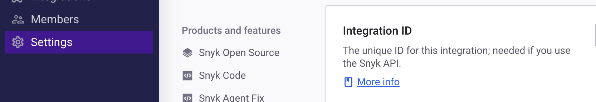
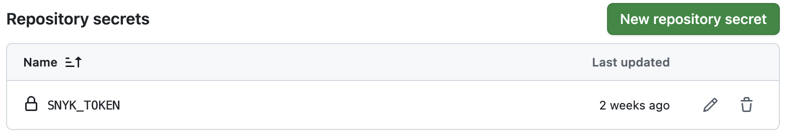

# CI/CD Demo Project

## Table of Contents

1. [Introduction to SAST and Snyk](#introduction)
2. [Prerequisites](#prerequisites)
3. [Understanding the Current Project](#understanding-project)
4. [Setting up Snyk Account](#setting-up-snyk)
5. [Configuring GitHub Secrets](#configuring-secrets)
6. [Integrating Snyk with GitHub Actions](#integrating-snyk)
7. [Advanced Snyk Configuration](#advanced-configuration)
8. [Interpreting Snyk Results](#interpreting-results)
9. [Best Practices](#best-practices)
10. [Troubleshooting](#troubleshooting)
11. [Hands-on Exercises](#exercises)

## 1. Introduction to SAST and Snyk {#introduction}

### What is SAST?

Static Application Security Testing (SAST) is a method of computer program debugging that analyzes source code to find security vulnerabilities before the software is deployed. Unlike Dynamic Application Security Testing (DAST), SAST examines code without executing it.

### What is Snyk?

Snyk is a developer-first security platform that helps you find and fix vulnerabilities in your code, dependencies, containers, and infrastructure as code. It provides:

- **Vulnerability scanning** for open source dependencies
- **License compliance** checking
- **Container security** scanning
- **Infrastructure as Code** security
- **Code security** (SAST) analysis

### Why Use Snyk with GitHub Actions?

- **Automated Security**: Runs security checks on every commit/PR
- **Early Detection**: Finds vulnerabilities before they reach production
- **Developer-Friendly**: Integrates seamlessly into existing workflows
- **Continuous Monitoring**: Monitors for new vulnerabilities in existing dependencies

## 2. Prerequisites {#prerequisites}

Before starting this practical, ensure you have:

- [ ] A GitHub account with repository access
- [ ] Basic understanding of Git and GitHub
- [ ] Familiarity with Java and Maven
- [ ] Understanding of CI/CD concepts
- [ ] Access to the `cicd-demo` repository

## 3. Project Setup

### 3.1 Clone the Repository

```bash# Clone the repository
git clone https://github.com/douglasswmcst/cicd-demo.git

# Navigate to the project directory
cd cicd-demo

# Verify the project structure
ls -la
```

### 3.2 Verify the environment

Ensure all the necessary tools are installed:

```bash
# Check Java version (should be 17 or higher)
java -version

# Check Maven installation
mvn -version

# Test the project builds successfully
mvn clean compile

# Run the tests to ensure everything works
mvn test
```

**why install `Apache Maven?`**

Apache Maven is primarily used as a build automation and project management tool, predominantly for Java-based applications.

## 4. Project Overview

The projectis a `Spring Boot application` with:

- **Framework**: Spring Boot 3.1.2
- **Java Version**: 17
- **Build Tool**: Maven
- **Dependencies**:
  - Spring Web
  - JavaFaker (for generating random data)
  - JaCoCo (for code coverage)

## 4. Setting up Snyk Account

### Step 4.1: Create a Snyk Account

1. **Visit Snyk Website**: Go to [https://snyk.io](https://snyk.io)
2. **Sign Up**: Click "Sign up for free"
3. **Choose Authentication**:
   - Recommended: Sign up with your GitHub account for easier integration
   - Alternative: Use email/password

### Step 4.2: Connect Your GitHub Account

1. **Navigate to Integrations**: In Snyk dashboard, go to "Integrations"
2. **Add GitHub Integration**: Click on "GitHub" integration
3. **Authorize Access**: Allow Snyk to access your repositories
4. **Import Repositories**: Select the repositories you want to monitor

### Step 4.3: Get Your Snyk Token

1. **Access Account Settings**: Click on your profile → "Account settings"
2. **Navigate to API Token**: Go to "Auth Token" section
3. **Generate Token**: Click "Show" to reveal your API token
4. **Copy Token**: Copy the token for later use in GitHub Secrets

⚠️ **Security Note**: Keep your API token secure and never commit it to version control!



## 5. Configuring GitHub Secrets 

### Step 5.1: Navigate to Repository Secrets

1. **Open Your Repository**: Go to your `cicd-demo` repository on GitHub
2. **Access Settings**: Click on "Settings" tab
3. **Navigate to Secrets**: Go to "Secrets and variables" → "Actions"

### Step 5.2: Add Snyk Token

1. **Create New Secret**: Click "New repository secret"
2. **Add Secret Details**:
   - **Name**: `SNYK_TOKEN`
   - **Value**: Paste your Snyk API token
3. **Save Secret**: Click "Add secret"

### Step 5.3: Verify Secret Configuration

- The secret should now appear in your repository secrets list
- It will show as `SNYK_TOKEN` with a green checkmark
- The value will be hidden for security



## 6. Integrating Snyk with GitHub Actions 

### Step 6.1: Basic Snyk Integration (Already Configured)

The current workflow already includes basic Snyk scanning. Let's understand each part:

```yaml
security:
  needs: test # Runs after test job completes
  name: SA scan using snyk # Job name
  runs-on: ubuntu-latest # Ubuntu runner
  steps:
    - uses: actions/checkout@master # Checkout code
    - name: Run Snyk to check for vulnerabilities
      uses: snyk/actions/maven@master # Use Snyk Maven action
      env:
        SNYK_TOKEN: ${{ secrets.SNYK_TOKEN }} # Access secret token
```

### Step 6.2: Enhanced Snyk Configuration

Let's create an enhanced version with more features:

```yaml
security:
  needs: test
  name: Security Analysis with Snyk
  runs-on: ubuntu-latest

  steps:
    - name: Checkout code
      uses: actions/checkout@v4

    - name: Set up JDK 17
      uses: actions/setup-java@v4
      with:
        java-version: "17"
        distribution: "temurin"
        cache: maven

    - name: Build project for Snyk analysis
      run: mvn clean compile

    - name: Run Snyk to check for vulnerabilities
      uses: snyk/actions/maven@master
      env:
        SNYK_TOKEN: ${{ secrets.SNYK_TOKEN }}
      with:
        args: --severity-threshold=high --fail-on=upgradable

    - name: Upload Snyk results to GitHub Code Scanning
      uses: github/codeql-action/upload-sarif@v2
      if: always()
      with:
        sarif_file: snyk.sarif

    - name: Monitor dependencies with Snyk
      uses: snyk/actions/maven@master
      env:
        SNYK_TOKEN: ${{ secrets.SNYK_TOKEN }}
      with:
        command: monitor
```

### Step 6.3: Understanding Snyk Action Parameters

| Parameter                    | Description                             | Example                             |
| ---------------------------- | --------------------------------------- | ----------------------------------- |
| `--severity-threshold`       | Minimum severity to report              | `low`, `medium`, `high`, `critical` |
| `--fail-on`                  | Conditions to fail the build            | `all`, `upgradable`, `patchable`    |
| `--file`                     | Specific file to scan                   | `pom.xml`                           |
| `--exclude-base-image-vulns` | Exclude base image vulnerabilities      | (for container scans)               |
| `--json`                     | Output results in JSON format           |                                     |
| `--sarif`                    | Output SARIF format for GitHub Security |                                     |


